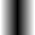
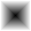
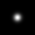
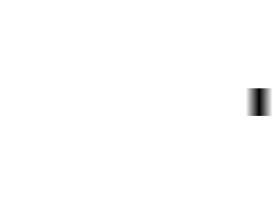

# Neuromorphic Sampling

This repository contains some experiments for reconstruction of simple image patterns. The DVS outputs of the input patterns are simulated and a reconstruction scheme is used to perform reconstruction

Any of the datasets available  <a href=> here </a> can be used as the `data` folder.

The pattern used in the experiment are shown below

<table style="width:100%">
    <tr>
        <td style="text-align:center"> </td>
        <td style="text-align:center"> </td>
        <td style="text-align:center"> </td>
    </tr>
</table>

# Procedure
The patterns and their movement over a background image can be generated using the `generate_square.py` script. Changing the variables in the script generates different patterns.

The DVS output is simulated by running the following command

`python atis_simulator.py <directory\of\pattern\movement\images>`

The threshold for event firing can be adjusted by changing the `threshold` variable. The simulated events get stored as files and images in teh `event_output\` directory.

Run the following command to get reconstruction using delta modulation
`python deltaModulate.py`

Some of the reconstruction appear as follows

<table style="width:100%">
    <tr>
        <td style="text-align:center"> </td>
        <td style="text-align:center"> </td>
        <td style="text-align:center"> </td>
        <td style="text-align:center"> </td>
    </tr>
</table>

To understand how events occur in an event based camera, please watch the video at this <a href="https://www.youtube.com/watch?v=kPCZESVfHoQ">link.</a>

Below are the links to different types of Event Cameras,

1. <a href="http://inivation.com/"> DAVIS </a>

2. <a href="https://www.prophesee.ai/"> ATIS </a>
